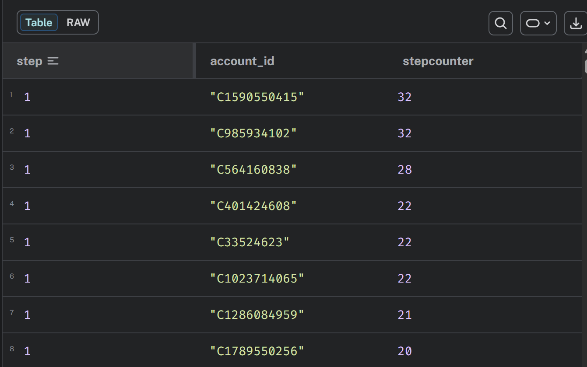
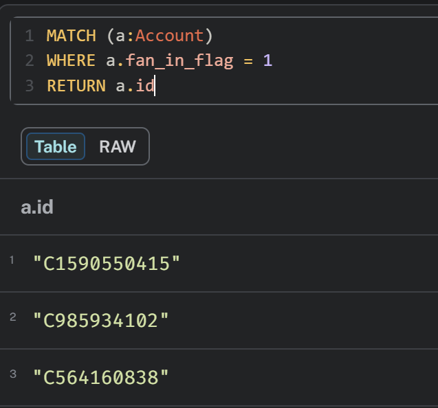

`MATCH (a:Account)-[t:TRANSACTION]->(b:Account)`  
`WITH t.step as step, b, count(DISTINCT a.id) as stepcounter`  
`RETURN step, b.id as account_id, stepcounter`  
`ORDER BY stepcounter DESC, step ASC`  
`LIMIT 500`  

This query will return the highest values for stepcounter, which is the number of accounts (a) that had transactions with this account (b), during a single step.

  

The highest values all occur within the first 1-10 steps of the month; this is likely due to reoccurring monthly payments, but I'm not the analyst  
All stepcounter values go sequentially up until 22, where the top 3 accounts jump to 28 or more, so I'm going to flag them here:  

`MATCH (a:Account)-[t:TRANSACTION]->(b:Account)`  
`WITH t.step as step, b, count(DISTINCT a.id) as stepcounter`  
`WHERE stepcounter > 22`  
`SET b.fan_in_flag = 1`  

Then checking which accounts have been flagged:  
