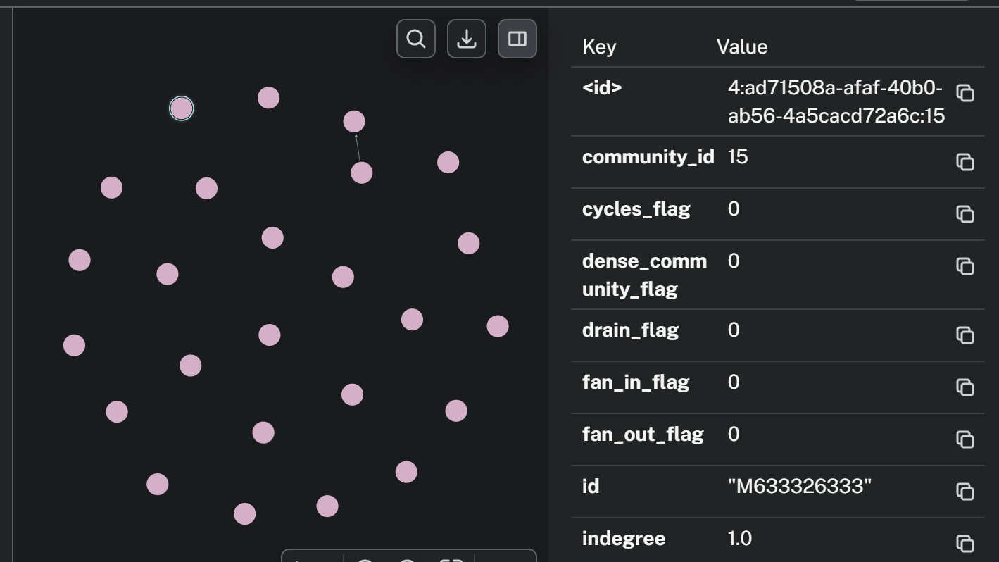

## Step 1: Write the outdegree property to every node using gds write

`CALL gds.graph.project('graph0','*','*')`  
(NOTE: This command has to be ran everytime you restart your instance.)  

`CALL gds.degree.write('graph0', {writeProperty: 'outdegree'})`  
`YIELD centralityDistribution`  
`RETURN centralityDistribution` 

## Step 2: Query the database to find outliers to be flagged.  
In this case, if an account sends money to more than 99.9% of other accounts, it is flagged.

`CALL gds.degree.stats('graph0')`  
`YIELD centralityDistribution`  
`MATCH (a:Account)-[t:TRANSACTION]->(b:Account)`  
`WHERE a.outdegree > centralityDistribution.p999`  
`RETURN t.step, a.id, a.outdegree`  
`ORDER BY t.step ASC, a.outdegree DESC`  

## UPDATE as of 4-27-26
`MATCH (a:Account)-[t:TRANSACTION]->(b:Account)`  
`WHERE a.community_id <> b.community_id`  
`RETURN a.community_id as community, sum(t.amount) as total, count(a) + 1 as members, (sum(t.amount)/count(a)+1) as outratio`  
`ORDER BY outratio DESC, total DESC, members DESC`  
`LIMIT 500`  

The highest outdegree value for a single step is 2, which is not high enough to be considered suspicious, so we will write the fan-out-flags's weight as 0

`MATCH (a:Account)`  
`CALL(a) {`  
`SET a.fan_out_flag = 0`  
`} IN TRANSACTIONS OF 10000 ROWS`  

^^ This is what I'm using to write the flag weight for each signal, since there is no fraud for fan-out I'm just leaving them all at 0 by default  
Repeat for fan_in_flag, drain_flag, transfer_cashout_flag, dense_community_flag, and cycles_flag for first pass

