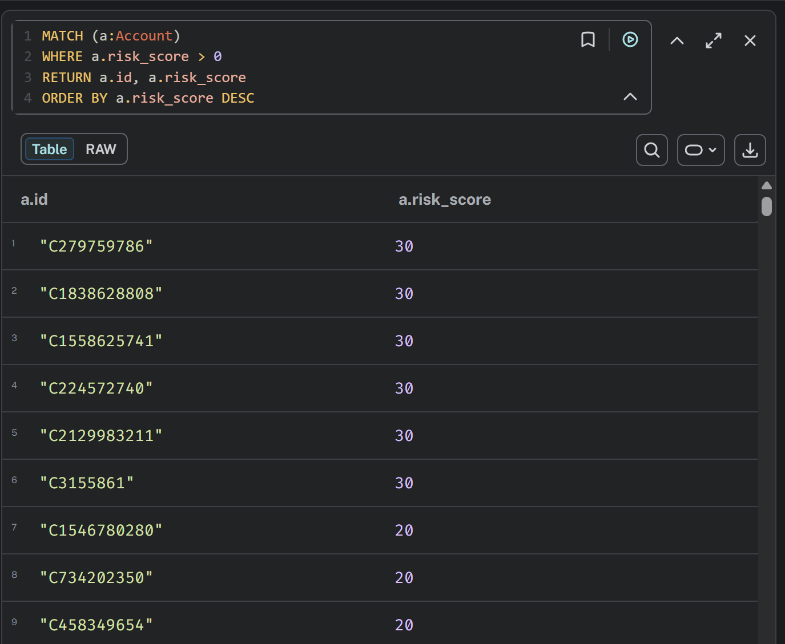

`MATCH(a:Account)`  
`CALL (a) {`  
`SET a.risk_score =`  
`(a.fan_out_flag * 10) +`  
`(a.fan_in_flag * 10) +`  
`(a.drain_flag * 15) +`  
`(a.transfer_cashout_flag * 15) +`  
`(a.dense_community_flag * 20) +`  
`(a.cycles_flag * 20) +`  
`(a.association_flag * 10) +`  
`(a.ringtoring_flag * 10)`  
`} IN TRANSACTIONS OF 1000 ROWS`  

This query sums the flag weight values of each nodes and writes it back to its risk score. After running this query I found that there are 2231 accounts with some risk score above zero. Unfortunately the highest risk score is only 30, and there are only 608 records with more than 10, and only 6 records with 30 risk.  

